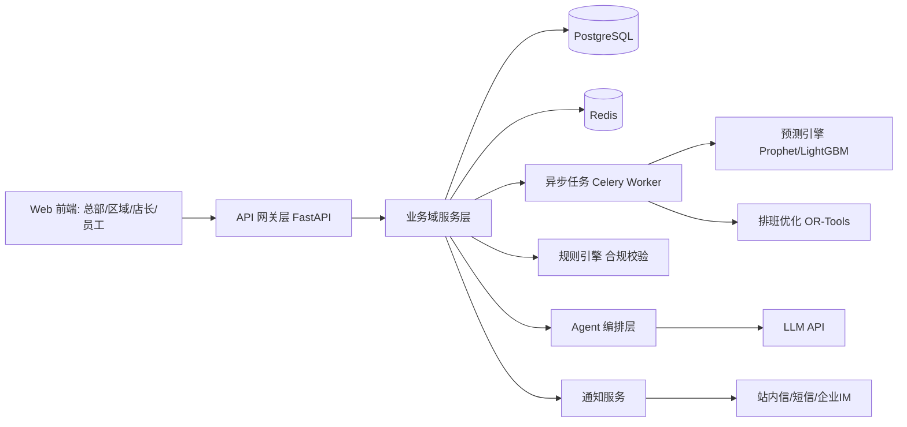
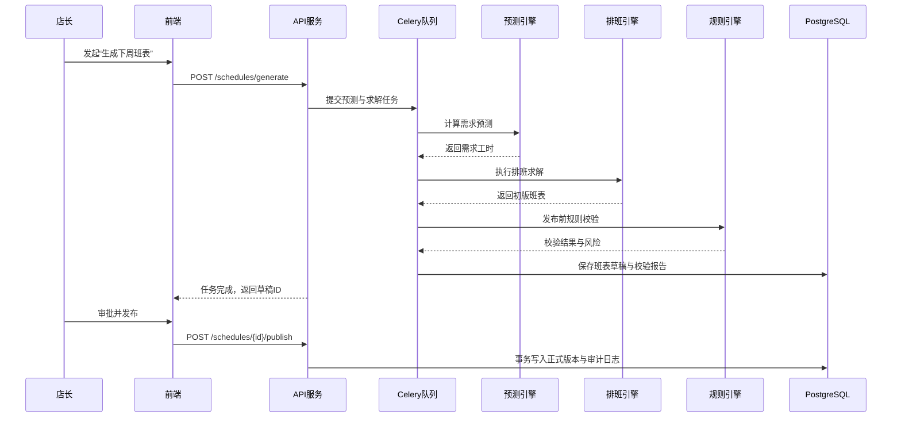
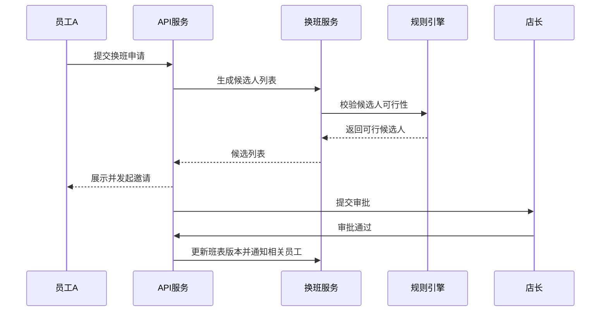
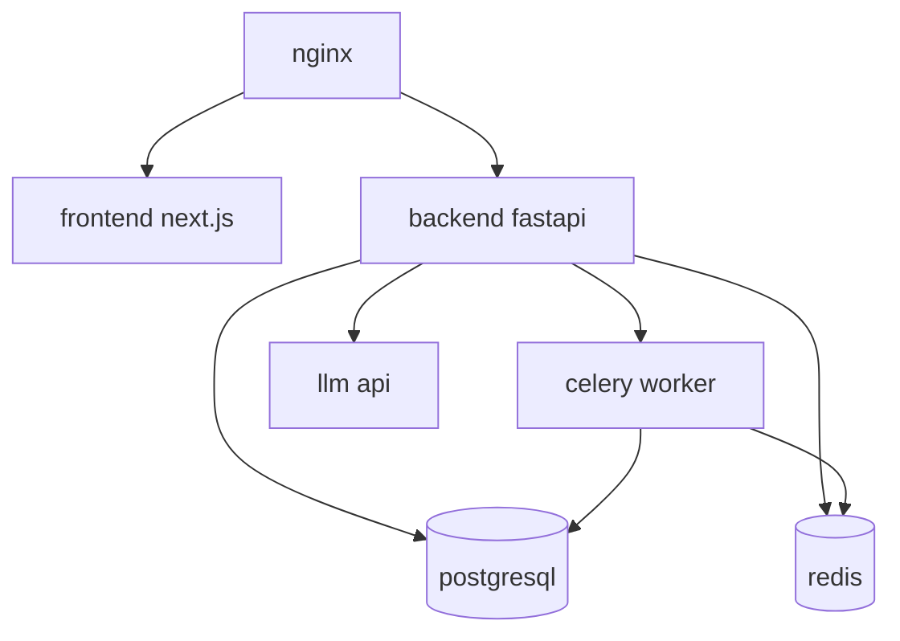

# 智慧排班 Agent 架构设计方案（展示版 v1）

## 1. 架构目标

本方案面向“第一版可展示系统”，目标是以最小复杂度跑通以下核心业务链路：

1. 数据导入与门店基础配置
2. 需求预测（分时段、岗位级）
3. 自动排班（硬约束 + 软约束）
4. 合规校验与冲突解释
5. 店长审批发布与版本管理
6. 员工查班、请假、换班
7. Agent 对话式调班建议

## 2. 架构原则

- `单体优先，模块清晰`：展示版采用模块化单体，避免微服务治理开销。
- `计算异步化`：预测、求解、批处理均走异步任务，保证 API 响应稳定。
- `强一致发布`：班表发布、审批、变更采用事务控制。
- `可解释与可审计`：每次排班与变更都可追溯原因和操作者。
- `人审闭环`：Agent 只提供建议，最终变更必须人工确认。

## 3. 总体架构图

## 4. 逻辑分层设计

## 4.1 表现层（Frontend）

- 店长工作台：预测视图、班表编辑、冲突提示、审批发布。
- 员工端：班表查询、请假、换班、可用时间维护。
- 总部/区域看板：门店覆盖率、人效、合规风险、异常预警。

## 4.2 接入层（API）

- REST API 提供业务操作。
- WebSocket 推送任务状态和通知。
- JWT + RBAC 控制角色访问。

## 4.3 业务层（Domain Services）

- `ForecastService`：预测任务编排与结果管理。
- `SchedulingService`：排班求解、调整、版本化。
- `ComplianceService`：规则检查与风险分级。
- `ApprovalService`：审批流和发布控制。
- `WorkforceService`：员工、技能、可用性管理。
- `SwapLeaveService`：请假/换班处理。
- `AgentService`：自然语言意图解析、工具调用编排。

## 4.4 计算层（Async Workers）

- 需求预测任务。
- 排班求解任务。
- 批量重算任务（多门店）。
- 规则巡检任务。
- 报表聚合任务。

## 4.5 数据层

- PostgreSQL：核心业务数据、班表版本、审计日志。
- Redis：任务队列、短期缓存、分布式锁。
- 对象存储：导入文件、报表导出文件。

## 5. 核心模块职责

## 5.1 预测引擎

- 输入：历史销售、交易数、客流、促销、节假日、天气（可选）。
- 输出：门店 x 时段 x 岗位的需求工时。
- 要求：支持人工修正并留痕。

## 5.2 排班优化引擎

- 输入：需求工时、员工可用时间、技能、预算、规则。
- 约束类型：
  - 硬约束：资质、工时上限、休息间隔、门店营业时间。
  - 软约束：偏好、公平性、周末均衡、热门班次均衡。
- 输出：可行班表 + 目标值 + 冲突说明。

## 5.3 合规与规则引擎

- 规则来源：企业规则 + 地区规则。
- 校验阶段：
  - 求解前：过滤明显不可行输入。
  - 求解后：发布前二次校验。
  - 发布后：巡检告警。
- 输出：违规级别（阻断/警告/提示）与修复建议。

## 5.4 Agent 编排层

- 处理店长自然语言请求，如“周五晚高峰加一名收银”。
- 调用能力：
  - 查询班表
  - 触发重算
  - 应用调整建议
  - 解释冲突原因
- 约束：不得绕过规则校验和审批流。

## 6. 关键业务时序

## 6.1 周排班生成与发布

## 6.2 员工换班流程

## 7. 数据库逻辑模型（核心表）

| 表名 | 作用 | 关键字段 |
| --- | --- | --- |
| `stores` | 门店主数据 | `id`, `name`, `timezone`, `open_hours` |
| `employees` | 员工主数据 | `id`, `store_id`, `contract_type`, `status` |
| `employee_skills` | 员工技能 | `employee_id`, `skill_code`, `level` |
| `availability_slots` | 可用时间 | `employee_id`, `weekday`, `start_at`, `end_at` |
| `labor_rules` | 排班规则 | `scope`, `rule_code`, `payload` |
| `demand_forecasts` | 需求预测 | `store_id`, `slot_at`, `role_code`, `required_hours` |
| `schedule_versions` | 班表版本 | `id`, `store_id`, `week_start`, `status`, `version_no` |
| `shift_assignments` | 班次分配 | `schedule_version_id`, `employee_id`, `start_at`, `end_at`, `role_code` |
| `task_segments` | 班次内任务段 | `shift_id`, `task_code`, `start_at`, `end_at` |
| `leave_requests` | 请假申请 | `employee_id`, `date`, `status`, `reason` |
| `swap_requests` | 换班申请 | `from_employee_id`, `to_employee_id`, `status` |
| `audit_logs` | 审计日志 | `actor_id`, `action`, `resource`, `before`, `after`, `created_at` |

## 8. API 设计（MVP）

## 8.1 店长端

- `POST /api/v1/schedules/generate`
- `GET /api/v1/schedules/{id}`
- `POST /api/v1/schedules/{id}/validate`
- `POST /api/v1/schedules/{id}/publish`
- `POST /api/v1/schedules/{id}/adjust`
- `POST /api/v1/agent/commands`

## 8.2 员工端

- `GET /api/v1/me/schedules`
- `POST /api/v1/me/leaves`
- `POST /api/v1/me/swaps`
- `PATCH /api/v1/me/availability`

## 8.3 管理端

- `GET /api/v1/dashboard/coverage`
- `GET /api/v1/dashboard/compliance`
- `GET /api/v1/dashboard/productivity`

## 9. 部署架构（展示版）

## 10. 安全与权限

- 认证：JWT（短 token + 刷新 token）。
- 授权：RBAC（总部、区域、店长、员工）。
- 数据隔离：
  - 员工只能访问本人数据。
  - 店长仅访问所属门店。
  - 区域访问区域范围。
- 审计：
  - 班表生成、修改、审批、发布全留痕。
  - 合规拦截事件可追溯。

## 11. 可观测性设计

- 指标：
  - 排班求解耗时
  - 求解成功率
  - 发布失败率
  - 规则冲突数
  - Agent 建议采纳率
- 日志：
  - API 请求日志
  - 任务执行日志
  - 规则校验日志
  - 审批操作日志
- 告警：
  - 求解连续失败
  - 发布失败
  - 数据导入失败
  - 外部模型服务不可用

## 12. 高可用与容错（展示版策略）

- API 无状态，支持水平扩展。
- Celery worker 可按队列扩容。
- Redis 持久化开启 AOF。
- PostgreSQL 每日备份。
- 关键任务具备幂等键，避免重复执行。

## 13. 性能预算

- 单店周排班生成（含校验）<= 15 秒。
- 50 店批量排班 <= 10 分钟。
- 常规查询 API P95 <= 300 ms。
- 页面首屏加载 <= 2.5 秒（办公网络）。

## 14. MVP 里程碑与交付物

## 14.1 里程碑

1. M1（第 2 周）：基础数据模型、登录权限、门店与员工管理
2. M2（第 4 周）：预测服务、排班引擎、班表草稿生成
3. M3（第 6 周）：规则校验、审批发布、员工端查班与请假
4. M4（第 8 周）：换班流程、Agent 调班建议、看板与演示脚本

## 14.2 演示验收清单

- 可以导入一个月样例数据并完成预测。
- 可以自动生成至少 1 周班表。
- 可以识别并拦截至少 3 类违规规则。
- 可以完成“店长调整 -> 审批 -> 发布 -> 员工确认”闭环。
- 可以完成“员工请假 -> 系统识别缺口 -> 店长调班”闭环。
- Agent 可以回答两类问题：
  - “为什么这样排？”
  - “如何在不违规前提下调整？”

## 15. 后续演进路径（P1/P2）

- P1：跨店支援推荐、天气与活动增强特征、预测置信区间、策略模拟。
- P2：更复杂公平性目标、多区域法规包、移动端推送、实时事件驱动重排。

---

本架构方案保证展示版在“可运行、可解释、可演示”三项上达标，并保持向生产级系统平滑演进的技术路径。

